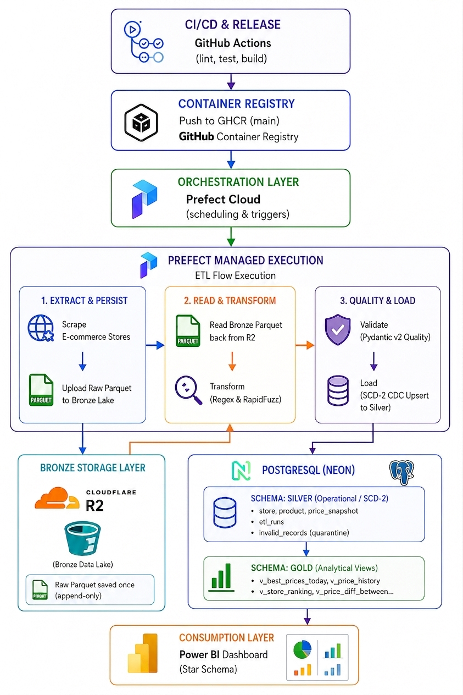
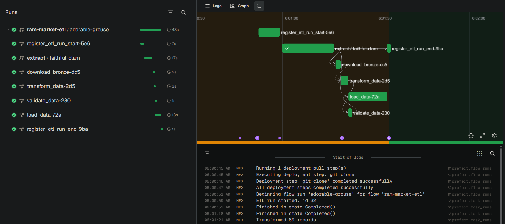
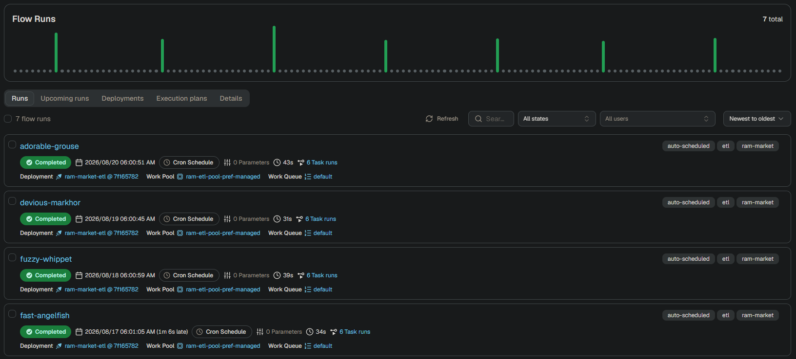
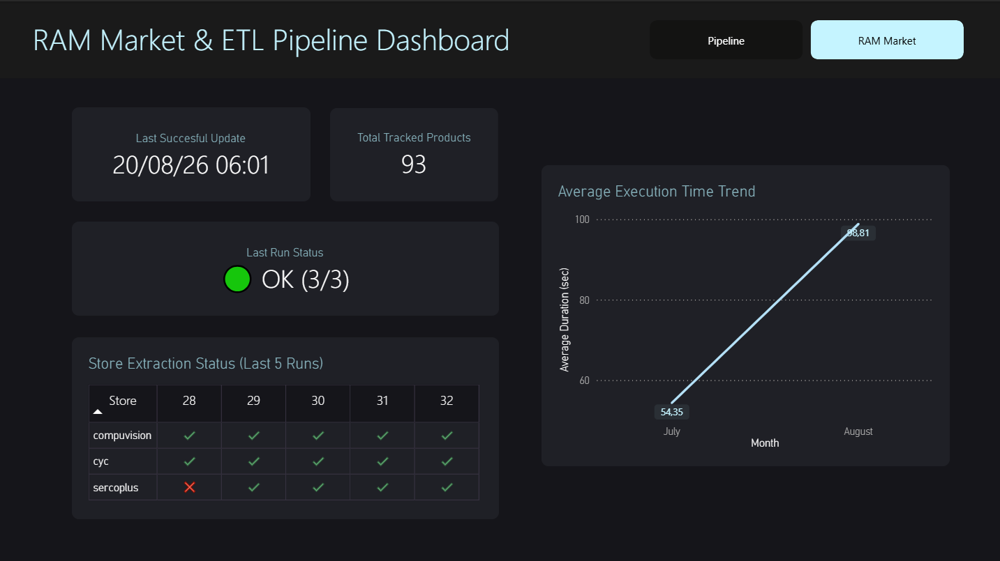
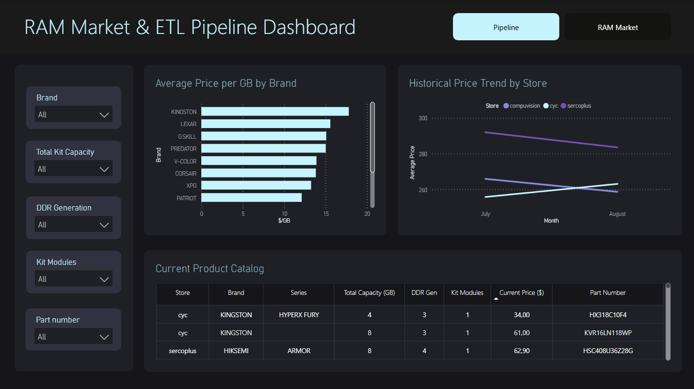

# RAM Market ETL

[Read it in Spanish (Español)](README.es.md)

An automated End-to-End ETL pipeline for monitoring PC hardware prices (RAM kits) across Peruvian tech retailers (3 initial stores). The system ingests raw e-commerce data into an **S3-compatible Data Lake**, normalizes technical specifications via **fuzzy matching and regex**, validates records using **Pydantic v2 schemas**, tracks historical pricing with **Slowly Changing Dimensions (SCD-2)** in **PostgreSQL**, and delivers actionable market insights through an interactive **Power BI** dashboard. The dashboard itself demonstrates the pipeline works.

---

## Architecture Overview



---

## Prefect runs




---

## Retailers

|Retailer|
|--------|
|Compuvision|
|CyC|
|Sercoplus|

> This project is for demonstration purposes only. I do not own any of the retailers' websites. The data collected is for personal use only and is not intended for commercial use.

---

## Medallion Architecture and Data Flow

### 1. Bronze Layer (Raw Data Lake)
- **Storage:** Cloudflare R2 (100% S3-compatible via `boto3`).
- **Format:** Columnar Parquet (`pyarrow` engine) with compression.
- **Partitioning Strategy:** Partitioned by date and UTC timestamp:
  ```
  r2://ram-market-lake/
  └── bronze/
      └── raw_data/
          └── YYYY-MM-DD/
              └── YYYY-MM-DDTHH-MM-SSZ/
                  └── raw_ram_data.parquet
  ```
- **Bronze-as-Source-of-Truth:** During each ETL run, raw data is scraped, immediately written to R2 Parquet, and then **re-read from R2** for transformation. This guarantees raw immutability, provides a full audit trail, and enables re-running transformations for any historical point in time without re-scraping.

### 2. Silver Layer (Cleaned, Validated and SCD-2 Data)
- **Storage:** PostgreSQL (Neon serverless) under the `silver` schema.
- **Structure:** 
  - `silver.store`: Store master catalog (`id`, `name`, `country`, `is_active`).
  - `silver.product`: Master product catalog with normalized specs (`part_number`, `brand`, `series`, `capacity_gb`, `speed_mts`, `ddr_gen`, `kit_modules`, `has_rgb`).
  - `silver.price_snapshot`: Slowly Changing Dimension Type 2 (SCD-2) tracking price changes with Change Data Capture (CDC).
  - `silver.etl_runs`: Execution metadata, run durations, store outcomes, and pipeline volume metrics.
  - `silver.invalid_records`: Quarantine table capturing records that failed Pydantic validation along with specific error reasons.

### 3. Gold Layer (Analytical-ready Views)
- **Storage:** PostgreSQL under the `gold` schema.
- **Purpose:** Decouples reporting consumption from internal table operations:
  - `gold.v_best_prices_today`: Lowest current price per product across all active stores.
  - `gold.v_price_history`: Full price evolution across stores with time bounds.
  - `gold.v_price_diff_between_stores`: Cross-store price comparisons showing absolute ($ USD) and relative (%) price differences.
  - `gold.v_etl_runs` and `gold.v_etl_store_status`: Detailed run histories and unpacked per-store execution statuses.

---

## Core Components

### 1. Modular Scraping (Factory Pattern)
- Modular scrapers extending a common `BaseScraper` class.
- **Extensibility**: Adding a new retailer requires only creating a new scraper module and registering it in `scrapers/factory.py` without modifying downstream pipeline logic.
- **Built-in resilience**: Custom user-agent headers, session reuse, and defensive parsing.
- Retailers' products (RAM kits) are obtained through internal APIs (web page internal APIs).

### 2. Normalization, Regex Extraction and Fuzzy Matching
- **Specification Extraction:** Regex parsing extracts total capacity (`capacity_gb`), memory generation (`ddr_gen`), memory frequency (`speed_mts`), and kit multipliers (`kit_modules`).
- **Brand and Series Resolution:** Product titles from retailers often contain typos or inconsistent naming (e.g., `"KNGSTON FURY"`). The pipeline uses `rapidfuzz` to match names against a canonical dictionary of brands and series, scoring confidence before assignment.
- **Natural Key Identification:** Standardized `part_number` acts as the unique hardware identifier in case where some not tracked attribute determines the product uniqueness.

### 3. Data Quality and Quarantine (Pydantic v2)
- Enforces strict data contracts using typed Pydantic models:
  - Validates numeric boundaries (e.g., `1600 <= Speed (MT/s) <= 10000`, `1 <= Capacity (GB) <= 256`, `Price > 0`).
  - Validates allowed literals (`DDR Generation` ∈ [3, 4, 5]).
  - Requires non-empty `part number` and `store`.
- **Fault-Tolerant Quarantine:** Records failing validation are separated via `split_valid_invalid()` and routed to `silver.invalid_records` with full `ValidationError` details. The pipeline continues processing valid records without crashing.

### 4. Change Data Capture (CDC) and SCD-2 Historical Tracking
- Avoids bloated daily snapshots by inserting rows into `silver.price_snapshot` **only when a price changes**.
- When a price change is detected:
  1. The existing active record is closed: `valid_to = NOW()`, `is_current = FALSE`.
  2. The new record is opened: `valid_from = NOW()`, `valid_to = NULL`, `is_current = TRUE`.

### 5. Orchestration, Testing and CI/CD
- **Orchestration:** Prefect Cloud schedules the pipeline on a 6-hour cron (`0 */6 * * *`) with automated retry logic.
- **Testing:** Comprehensive test suite with **137 unit tests** across scrapers, transformations, Pydantic schemas, and database loaders using `pytest`.
- **Containerization and CI/CD:** Docker multi-stage builds (`python:3.12-slim`, non-root user). GitHub Actions runs linters (`ruff`), tests (`pytest`), and pushes container images to GitHub Container Registry (GHCR).

---

## Key Engineering Decisions and Trade-offs

| Decision | Choice | Alternative Considered | Rationale |
|---|---|---|---|
| **Pipeline Paradigm** | **ETL** | ELT | Complex regex extraction and fuzzy matching (`rapidfuzz`) are efficiently handled in Python memory. Pushing unparsed messy text to Postgres for in-database transformation would add heavy database compute overhead. |
| **Raw Persistence** | **Data Lake First (Bronze)** | Direct DB Load | Writing raw scraped Parquet to R2 before transforming guarantees an immutable single source of truth, full auditability, and the ability to re-run transformations historically without re-scraping. |
| **Data Lake Storage** | **Cloudflare R2** | AWS S3 | Generous free tier (10 GB) and **zero egress fees**, while remaining 100% S3-compatible via standard `boto3` client code. |
| **Data Validation** | **Pydantic v2** | Great Expectations | Pydantic offers high-speed type-based validation, native Python typing integration, and minimal operational complexity for record-level schema enforcement. |
| **Historical Price Tracking**| **SCD-2 with CDC** | Full Daily Snapshots | Capturing only price changes reduces database storage growth by over 90% while preserving exact historical time boundaries (`valid_from` / `valid_to`). |
| **Orchestration** | **Prefect Cloud** | Apache Airflow | Python-native workflow definition, lightweight serverless coordination, and minimal infrastructure overhead for a single-developer deployment. |
| **Currency Handling** | **Normalized USD** | Mixed Local (PEN/USD) | Retailers publish prices in both currencies. Standardizing to USD at the ETL layer removes currency ambiguity from analytical queries and Gold views. |
| **Silver Schema Design** | **Hybrid Dimensional** | Star Schema | Silver uses a hybrid relational model where `price_snapshot` serves as the central fact-like table and product / store as dimensions. This provides a dimensional structure for the project's analytical needs while preserving the operational and data-quality concerns of the Silver layer without introducing a full star schema. |
| **Database Engine** | PostgreSQL (OLTP) | OLAP / DWH (e.g., Snowflake, BigQuery) | The project's data scale (~hundreds of records per run, thousands of snapshots/year) does not warrant the complexity, cold-start latency, or operational costs of a distributed OLAP engine. PostgreSQL offers ACID transactions essential for safe atomic SCD-2 upserts, native schema isolation (Silver/Gold), partial indexing for fast CDC lookups, and excellent query performance for downstream BI consumption at zero cost via Neon serverless. Although, in the future, if the project grows, it may need to migrate to an OLAP / DWH engine.|

---

## Power BI Dashboard

The analytical layer connects to PostgreSQL using a dedicated read-only role (`bi_reader`) and models the data into a **Star Schema** (`dim_product`, `dim_store`, `dim_date`, `fact_price`, `etl_runs`, `etl_store_status`).

### Page 1: Pipeline Monitoring



- **KPI Cards:** Last successful execution timestamp, average ETL run duration (seconds) and total active products tracked.
- **Store Status Traffic Light:** Visual status indicator (`ok` / `failed`) per store based on `gold.v_etl_store_status`.
- **Run Health and Execution Trends:** Line and bar charts displaying historical run durations

---

### Page 2: RAM Pricing Analysis



#### 1. Market Catalog
- **Design Choice (Table over Matrix):** A structured **Table** acts as a technical spec-sheet. It displays Brand, Series, Capacity, DDR Generation, Kit Configuration, Part Number and Current Price.

#### 2. Core DAX Measures and Calculated Columns

- **`Current Price`:**
  ```dax
  Current Price = 
  CALCULATE(
      AVERAGE(fact_price[price]),
      fact_price[is_current] = TRUE
  )
  ```

- **`Avg Price per GB` ($/GB Metric):**
  ```dax
  Avg Price per GB = 
  CALCULATE(
      AVERAGEX(
          fact_price,
          DIVIDE(fact_price[price], RELATED(dim_product[capacity_gb]))
      ),
      fact_price[is_current] = TRUE
  )
  ```

- **`Effective Price (as-of)` (Historical SCD-2 Point-in-Time Reconstruction):**
  ```dax
  Effective Price (as-of) = 
  VAR selectedDate = MAX(dim_date[date])
  VAR selectedDateTime = selectedDate + TIME(23, 59, 59)
  RETURN
  CALCULATE(
      AVERAGE(fact_price[price]),
      REMOVEFILTERS(dim_date),
      fact_price[valid_from] <= selectedDateTime,
      ISBLANK(fact_price[valid_to]) || fact_price[valid_to] > selectedDateTime
  )
  ```

- **`is_outlier` (Calculated Column in `fact_price` for Outlier Detection):** Uses the median per DDR generation to detect outliers (30% - 500% of the median price).
  ```dax
  is_outlier = 
  VAR vCurrentPrice = fact_price[price]
  VAR vCurrentDDR = RELATED(dim_product[ddr_gen])

  VAR vMedianaDDR = 
      CALCULATE(
          MEDIAN(fact_price[price]),
          ALL(fact_price),
          dim_product[ddr_gen] = vCurrentDDR
      )

  RETURN
      IF(
          ISBLANK(vCurrentPrice) || vCurrentPrice <= 0 ||
          vCurrentPrice > (vMedianaDDR * 5) || 
          vCurrentPrice < (vMedianaDDR * 0.3),
          TRUE(),
          FALSE()
      )
  ```

#### 3. Core Market Insights and Visuals
- **Price Evolution Line Chart:** Traces historical price trajectories per store, capturing competitor price drops, flash promotions, and market trends over time.
- **Avg Price per GB by Brand:** Evaluates brand price positioning across equivalent memory segments.
- **Top Savings Opportunities:** Powered by `gold.v_price_diff_between_stores`, directly highlighting arbitrage opportunities where identical part numbers have large price spreads between stores.

---

## Viewing the dashboard

1. Clone the repository:

  ```bash
  git clone <repository-url>
  ```

2. Open the Power BI file: **`dashboard/dashboard.pbip`**
3. Data can't be refreshed. The credentials are not available.

---

## Technology Stack

- **Data Extraction:** Python 3.12, `requests`, `curl_cffi`
- **Transformation and Normalization:** `pandas`, `rapidfuzz`, `pyarrow`
- **Data Quality and Validation:** `pydantic` v2
- **Data Lake (Bronze):** Cloudflare R2 (Object Storage / S3 API via `boto3`)
- **Database and Storage (Silver / Gold):** PostgreSQL 15+ (Neon Serverless)
- **Orchestration:** Prefect Cloud
- **Business Intelligence:** Power BI Desktop (PBIP format, DAX, Star Schema)
- **Containerization and CI/CD:** Docker, GitHub Actions, GHCR
- **Testing and Tooling:** `pytest` (137 tests), `ruff`, `poethepoet`, `uv`
